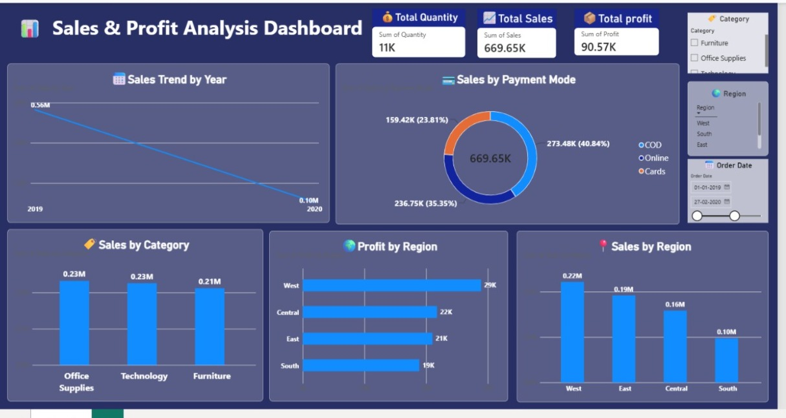

# 📊 Sales & Profit Analysis Dashboard | Power BI

## 📌 Project Overview

This project is an interactive Sales & Profit Analysis Dashboard created using Microsoft Power BI.

The dashboard helps analyze sales performance, profit, quantity, categories, regions, payment modes, and yearly sales trends.

## 🎯 Project Objective

The main objective of this project is to transform sales data into an interactive dashboard and identify important business insights through data visualization.

## 🛠️ Tools & Technologies

- Microsoft Power BI
- DAX
- Data Visualization
- Data Analysis
- Interactive Slicers
- KPI Cards

## 📊 Key KPIs

- 💰 Total Sales: 669.65K
- 📈 Total Profit: 90.57K
- 📦 Total Quantity: 11K

## 🔍 Dashboard Features

- 📅 Sales Trend by Year
- 💳 Sales by Payment Mode
- 🏷️ Sales by Category
- 🌍 Sales by Region
- 📈 Profit by Region
- 🎛️ Interactive filters for Category, Region and Order Date

## 🖼️ Dashboard Preview

## 💡 Key Learning

Through this project, I improved my practical understanding of Power BI, data visualization, dashboard design, KPI creation, and presenting data in a meaningful way.

## 👩‍💻 Project Type

Data Analytics / Power BI Portfolio Project
